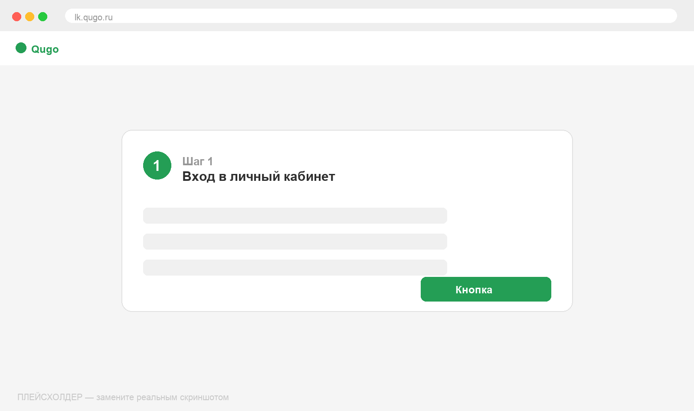
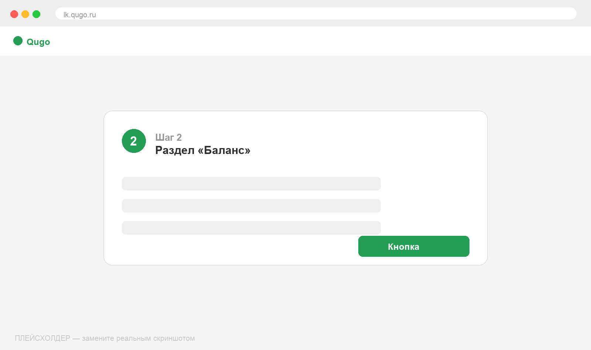
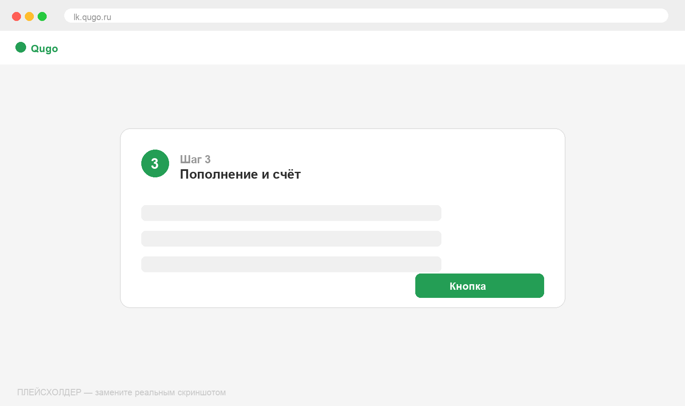

# Пополнение баланса

Для проведения выплат исполнителям на балансе компании должны быть средства. Пополнить баланс можно в любое время.

## Как пополнить

<Steps>
  <Step title="Войдите в личный кабинет">
    Откройте [lk.qugo.ru](https://lk.qugo.ru) и авторизуйтесь под учётной записью компании.

    
  </Step>
  <Step title="Перейдите в раздел «Баланс»">
    В левом меню личного кабинета выберите раздел **Баланс**.

    
  </Step>
  <Step title="Нажмите «Пополнить» и скачайте счёт">
    Нажмите кнопку **Пополнить**, укажите сумму и скачайте счёт на оплату.

    
  </Step>
  <Step title="Оплатите счёт">
    Оплатите счёт с расчётного счёта компании. Средства зачисляются после
    поступления оплаты — обычно в течение 1 рабочего дня.
  </Step>
</Steps>

## Важно знать

- Средства должны быть на балансе **до** момента проведения выплат
- Минимальная сумма пополнения зависит от условий вашего тарифа
- При регулярных выплатах рекомендуем поддерживать запас на балансе

:::tip Совет
Следите за балансом в разделе **Отчёт по балансу** — там видна полная картина движения средств. Подробнее: [Отчёт по балансу](../otchet-po-balansu).
:::
